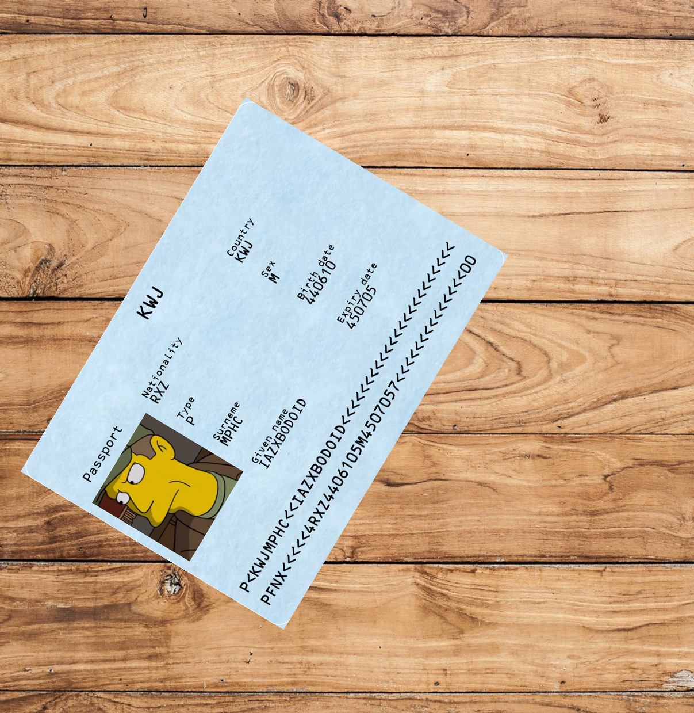

# MRZ Generator TD3 Code

sample size u settings.json i run main.py

- slike nisu iste velicine zbog rotacije i sl. 

result  
    ├─── images  
    ├─── masks  
    └─── MRZ_values.json  
  
/helpers/document_background - slike koju mogu biti pozadina za dokument
/helpers/background - slike koje mogu biti pozadina za sliku
/helpers/person - slike za facu osobe

